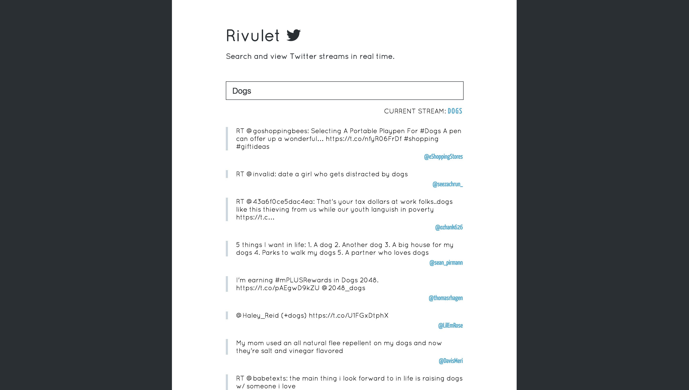

# TwitterStream

### Installation
	$ npm install
	$ npm install -g nodemon webpack

### Usage
	$ nodemon index.js    // to run the server
	$ webpack             // to bundle your styles(scss) and js(es6)

### Technologies Used
* ES6 (Babel Transpilation)
* Webpack to bundle
* SCSS
* React
* Twit (excellent node Twitter API module)
* SocketIO (real time updates via websockets)
* Express (application route handling and static asset delivery)
* HTTP (built in node http server)

